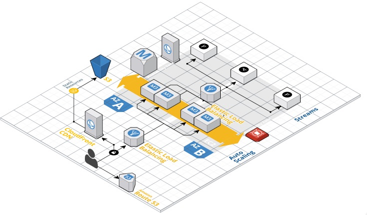
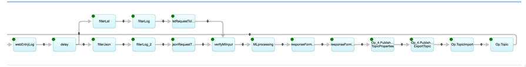
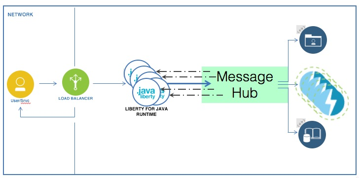

# MqStreamsProxy : MQRabbit/Streams High Throughput WEB Integration

This example illustrates how the the RabbitMQRequestResponse() operator is used in a high though put web site, the web site is envisioned to have be processing micro services or standard gets/post. This will go through the operating contexts, design and installation. 

## Context 
The intent is provide an example  within a significant web shop. A site that needs to to work loads dynamically without impacting the users experience.

The Streams application would be used to respond to real time processing requests. The web site would specialized components to various aspect site processing. 

- Mobile and Browser rendering.
- Caching context
- Security / Validation 

The schematic illustrates Streams processing embedded in larger WEB environment, integrated with function specific components that process the requests. A significant web site is composed of a components that are routed and replicated to handle the current loads, Streams is anaylytics/streaming component of this. 
The users request has been load balanced and scaled to the Streams application. 

The take away, Streams handles time bound and resources intensive processing. Superior components exist for: load balancing, routing, session management and rendering would be used in such an environment. 

The scenario involves a http/REST requests fielded by a WebServer that is mapped to message broker that communicates with Streams. The sample uses and J2EE Server (WebSphere Liberty) and AMQP  message (RabbitMQ) brokers. The message broker enables more clients (WebServer) and/or requests processors (Streams) to be added independently.
The example uses LiberyServer webserver using J2EE specification and RabbitMQ using XXXX specification. The standard are stable enough that most if not all the code provided is applicable to your environment.

## Implementation Specifics
The design is based upon the RabbitMQ's [Remote procedure call RPC](https://www.rabbitmq.com/tutorials/tutorial-six-python.html) pattern. Using the terminology of the design the application server is client of the Streams application. A client creates private response queue on start up, requests are sent over a common queue that all clients and servers are connected. The server (Streams application) gets the requests with a responseQueue identifier and processes the request. Responses are returned on the responseQueue the accompanied the request. 

The design allows new clients (application servers) and server (Streams instances) to be added and removed independently. The only well know resource is the queue that all 
requests from the client to server use. 

The J2EE application uses the J2EEv3 asynchronous processing feature which enables multiple web requests to be outstanding at a time. The Streams example application
 is written as a pipeline.  

This simple implementation's drawback becomes apparent when one of the operator's goes compute bound, all the pipeline's prior pipeline nodes are delayed waiting for the CPU bound request to finish. Instantiating another server application resolve the issues, the message hub will distribute requests to the idle server. If the application server becomes inundated, new instance can be added as well. 

The following diagram is a more focused  view the processing distribution. 

This example is a general case of processing Streams requests on a large web site. Significant websites' are customized beyond the scope of this example. The goal is provide some guidance with the provided code in order to integrates Streams component within your website's environment. 

## Sample Overview. 
 
This is a walk through of bringing up the sample. This involves a J2EE server, Streams and RabbitMQ. 

### Missing  
- security configuration if using the default password, localhost issue

This sample has consists of J2EE Liberty Servlet communicating with Streams via RabbitMQ.  

The components can be scaled independently by adding/removing Servlets or Streams applications as load fluctuates. 

The directories : 

* RabbitMQRabbitRestServer : A Steams application that executes commands: 
sleep, fill and mirror. Commands and the corresponding results are
communicated via RabbitMQ. 
* MqStreamsProxy : A J2EE Servlet that accepts REST 
requests, transmits them via MQRabbit which 
are processed by the Streams application. The 
processing results are returned following the opposite path. 

### PreRequisites  
- [Streams QSE](https://www.ibm.com/developerworks/downloads/im/streamsquick/index.html) : This is Includes Streams development environment where the sample code can be inspected and modified. 
- [RabbitMQ](https://www.rabbitmq.com/download.html) 
- [LibertyServer](https://developer.ibm.com/wasdev/downloads/liberty-profile-using-eclipse/) : Includes the Eclipse development environment where the sample code can be inspected and modified. 

## Components 

In order to demo you need the following. My development 
consists of a Mac running OSX and QSE4.2 VM running on the
same machine. 

* RabbitMQ installed configured and running. This is running 
on the Mac. 
* LibertySever Installed and running. This is running on the Mac, 
I'm using the Bluemix Cloud  since include and IDE as well. 
* Optional : Maven installed, on the VM hosting system, in my case that is 
on the Mac. Streams QSE has maven installed, you can build within the QSE and copy 
the resulting war to the with Liberty for deployment.  

## Configuration 
1) In the scenario presented here, RabbitMQ is on the
VMHost (mac) moving messages between the mac and the VM using the default 
RabbitMQ username password (guest/guest). 
~~~
By default, the guest user is prohibited from connecting to the broker remotely; it can 
only connect over a loopback interface (i.e. localhost). 
~~~
To remedy the situation refer to  : https://www.rabbitmq.com/access-control.html. 
 

2) You will need the host computer name or IP when submitting the Streams 
application, in my case it charon.local.  

# Bringing up the components. 

* Bring up RabbitMQ

* Import the Streams application, build and run it. It can run in standalone or distribured mode.

* Build the Server using maven 
~~~
> cd ... MqStreamsProxy
> mvn clean
> mvn war:war
~~~

Deploy the resulting application using
   ... MqStreamProxy/target/MqStreamProxy-1.0.war
   
# Demo  

Rest requests to the application can be made with curl from 
the command line. The request has the following format:

* fill : number of 'A' to return. 
* sleep : number of seconds to wait, simulates computation. 
* mirror : reflect back request. 

## Request 
~~~
curl "http://localhost:9080/MqStreamsProxy/MqStreamsProxy?fill=5&amp;sleep=5&amp;mirror=0"
~~~

## Response
The resut request returns after 5 seconds, note that the 5 'A's of fill. 
~~~
{"sequenceNumber":"44","request":"fill=5&amp;sleep=1&amp;mirror=0","method":"GET","timeString":"","contextPath":"/MqStreamsProxy","block":"1","fill":"AAAAA","pathInfo":"/MqStreamsProxy"}
~~~

 
